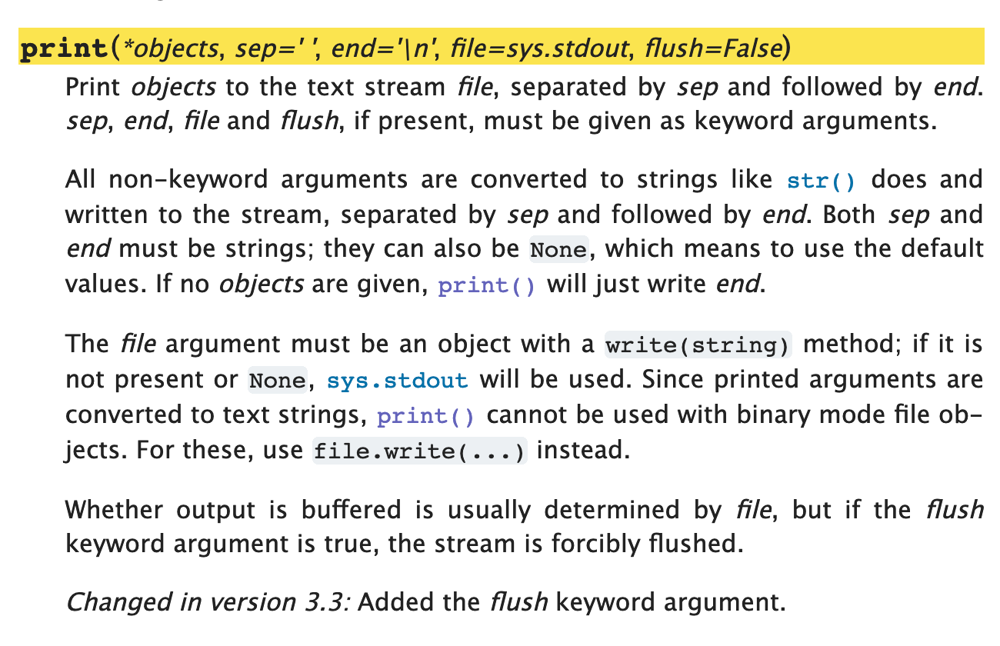
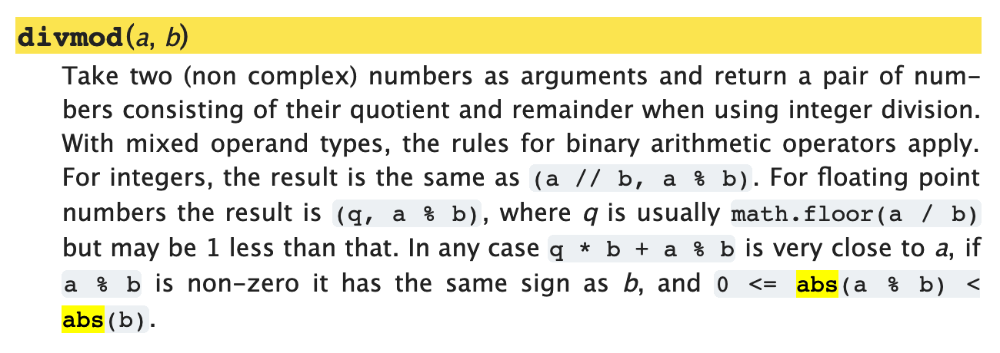

# 函数

函数，实际上是可被调用的完整的程序。它具备输入、处理、输出的功能。又因为它经常在主程序里被调用，所以它总是更像是个子程序。
了解一个函数，无非是要了解它的两个方面：

> * 它的**输入**是怎么构成的（都有哪些参数？如何指定？）；
> *
以及它的**输出**是什么（返回值究竟是什么？）……

从这个角度看，牛，对人类来说就是个函数，它吃的是_草_，挤出来的是*奶*…… 开玩笑了。
在我们使用函数的过程中，我们常常_有意忽略_它的内部如何完成从输出到输出之间的_处理过程_ ——
这就好像我们平日里用灯泡一样，大多数情况下，我们只要知道开关的使用方法就够了 ——
至于为什么按到这个方向上灯会亮，为什么按到另外一个方向上灯会灭，并不是我们作为用户必须关心的事情……
当然，如果你是设计开关的人就不一样了，你必须知道其中的运作原理；但是，最终，你还是希望你的用户用最简单方便的操作界面，而不是必须搞懂所有原理才能够使用你所设计的产品……
当我们用 Python
编程的时候，更多的情况下，我们只不过是在使用别人已经写好的函数，或者用更专业一点的词藻，叫做“已完好封装的函数”。而我们所需要做的事情（所谓的“学习使用函数”），其实只不过是“通过阅读产品说明书了解如何使用产品”而已，真的没多神秘……
**注意**

>
这一章的核心目的，不是让你学会如何写函数；而是通过一些例子，让你大抵上学会“_如何阅读官方文档中关于函数的使用说明_”。也请注意之前的那个词：“_大抵上_”，所以**千万别怕自己最初的时候理解不全面**。
另外，这一章中用来举例的函数，全部来自于同一个官方文档页面，[Built-in
Functions](https://docs.python.org/3/library/functions.html)：

>
https://docs.python.org/3/library/functions.html

## 示例 print()

### 基本的使用方法

`print()` 是初学者最常遇到的函数 —— 姑且不说是不是最常用到的。
它最基本的作用就是把传递给它的值输出到屏幕上，如果不给它任何参数，那么它就输出一个空行：

```python
print('line 1st')
print('line 2nd')
print()
print('line 4th')
```

你也可以向它传递多个参数，它就会把那些值逐个输出到屏幕，每个值之间用空格分开。

```python
print('Hello,', 'jack', 'mike', '...', 'and all you guys!')
```

当我们想把变量或者表达式的值插入字符串中的时候，可以用 f-string：

```python
name = 'Ann'
age = '22'
print(f'{name} is {age} years old.')
```

但，这并不是 `print()` 这个函数的功能，这实际上是
[`f-string`](https://docs.python.org/3/library/stdtypes.html#printf-style-
string-formatting) 的功能，`f-string` 中用花括号 `{}`
扩起来的部分是表达式，最终转换成字符串的时候，那些表达式的值（而不是变量或者表达式本身）会被插入相应的位置……

```python
name = 'Ann'
age = '22'
f'{name} is {age} years old.'
```

所以，`print(f'{name} is {age} years old.')` 这一句中，函数 `print()`
完成的还是它最基本的功能：给它什么，它就把什么输出到屏幕上。

### print() 的官方文档说明

以下，是 print()
这个函数的[官方文档](https://docs.python.org/3/library/functions.html#print)：


最必须读懂的部分，就是这一行：

> `print(*object, sep=' ', end='\n',
file=sys.stdout, flush=False)` <a href='#fn1' name='fn1b'><sup>[1]</sup></a>
先只注意那些有着 `=` 的参数，`sep=' '`、`end='\n'`、`file=sys.stdout`，和 `flush=False`。
这其中，先关注这三个 `sep=' '`、`end='\n'`、`file=sys.stdout`：

> * `sep='
'`：接收多个参数之后，输出时，分隔符号默认为空格，`' '`；
> * `end='\n'`：输出行的末尾默认是换行符号 `'\n'`；
> *
`file=sys.stdout`：默认的输出对象是 `sys.stout`（即，用户正在使用的屏幕）……
也就是说，这个函数中有若干个具有默认值的参数，即便我们在调用这个函数的时候，就算没有指定它们，它们也存在于此。

即，当我们调用 `print('Hello',
'world!')` 的时候，相当于我们调用的是 `print('Hello', 'world!', sep=' ', end='\n',
file=sys.stdout, flush=False)`

```python
import sys                                  # 如果没有这一行，代码会报错

print('Hello', 'world!')                    # 下一行的输出和这一行相同
print('Hello', 'world!', sep=' ', end='\n', file=sys.stdout, flush=False)
print('Hello', 'world!', sep='-', end='\t')
print('Hello', 'world!', sep='~')           # 上一行的末尾是 \t，所以，这一行并没有换行显示
print('Hello', 'world!', sep='\n')          # 参数之间用换行 \n 分隔 
```

很多人只看各种教材、教程，却从来不去翻阅官方文档 —— 到最后非常吃亏。只不过是多花一点点的功夫而已，看过之后，就会知道：原来 `print()`
这个函数是可以往文件里写数据的，只要指定 `file` 这个参数为一个已经打开的文件对象就可以了（真的有很多人完全不知道）……

另外，现在可以说清楚了：

> `print()` 这个函数的返回值是 `None` —— 注意，它向屏幕输出的内容，与 `print()`
这个函数的返回值不是一回事儿。

做为例子，看看 `print(print(1))` 这个语句 —— `print()` 这个函数被调用了两次，第一次是
`print(1)`，它向屏幕输出了一次，完整的输出值实际上是 `str(1) + '\n'`，而后返回一个值，`None`；而第二次调用
print()，这相当于是向屏幕输出这个 `None`：

```python
print(print(1))
```

“**看说明书**”就是这样，全都看了，真不一定全部看懂，但，看总是比不看强，因为总是有能看懂的部分……

## 关键字参数

在 Python 中，函数的参数，有两种：
> * **位置参数**（Positional Arguments，在官方文档里常被缩写为 *arg*）
> *
**关键字参数**（Keyward Arguments，在官方文档里常被缩写为 *karg*）

在函数定义中，带有 `=`
的，即，已为其设定了默认值的参数，叫做 Keyword Arguments，其它的是 Positional Arguments。

在调用有 Keyword
Arguments 的函数之时，如若不提供这些参数，那么参数在执行时，启用的是它在定义的时候为那些 Keyword Arguments
所设定的默认值；如若提供了这些参数的值，那么参数在执行的时候，启用的是接收到的相应值。

比如，`sorted()` 函数，它的定义如下：

>
`sorted(iterable, *, key=None, reverse=False)`

现在先只关注它的 Keyword
Arugment，`reverse`：

```python
from IPython.core.interactiveshell import InteractiveShell
InteractiveShell.ast_node_interactivity = "all"

sorted('abdc')
sorted('abdc', reverse=True)
```

## 位置参数

位置参数，顾名思义，是“由位置决定其值的参数”。拿 `divmod()`
为例，它的[官方文档](https://docs.python.org/3/library/functions.html#divmod)是这样写的：


它接收且必须接收两个参数。

> *
当你调用这个函数的时候，括号里写的第一个参数，是被除数，第二个参数是除数 —— 此为该函数的输入；
> *
而它的返回值，是一个元组（Tupple，至于这是什么东西，后面讲清楚），其中包括两个值，第一个是商，第二个是余 —— 此为该函数的输出。
作为“这个函数的用户”，你不能（事实上也没必要）调换这两个参数的意义。因为，根据定义，被传递的值的意义就是由参数的位置决定的。

```python
from IPython.core.interactiveshell import InteractiveShell
InteractiveShell.ast_node_interactivity = "all"

divmod(11, 3)
a, b = divmod(11, 3)
a
b

divmod(3, 11)
a, b = divmod(3, 11)
a
b

```

## 可选位置参数

有些函数，如 `pow()`，有**可选的位置参数**（Optional Positional Arguments）。


于是，`pow()` 有两种用法，各有不同的结果：

> * `pow(x, y)` —— 返回值是 `x ** y`
> *
`pow(x, y, z)` —— 返回值是 `x ** y % z`

```python
from IPython.core.interactiveshell import InteractiveShell
InteractiveShell.ast_node_interactivity = "all"

pow(2, 3)
pow(2, 3, 4)
```

注意 `pow()` 函数定义部分中，圆括号内的方括号 `[, z]` —— 这是非常严谨的标注，如果没有 `z`，那么那个逗号 `,` 就是没必要的。

看看
`exec()` 的官方文档（先别管这个函数干嘛用的），注意函数定义中的两个嵌套的方括号：


这些方括号的意思是说：

> * 没在方括号里的 `object` 是不可或缺的函数，调用时必须提供；
> * 可以有第二个参数，第二个参数会被接收为
`globals`；
> * 在有第二个参数的情况下，第三个参数会被接收为 `locals`；
> * *但是，你没办法在不指定 `globals`
这个位置参数的情况下指定 `locals`……*

## 可接收很多值的位置参数

再回头看看 `print()`，它的第一个位置参数，`object` 前面是有个星号的：`*object, ...`。
对函数的用户来说，这说明，这个位置可以接收很多个参数（或者说，这个位置可以接收一个列表或者元组）。

再仔细看看 `print()`，它只有一个位置参数：


因为位置决定了值的定义，一般来说，一个函数里最多只有一个这种可以接收很多值的位置参数 ——
否则如何获知谁是谁呢？

如果与此同时，还有若干个位置参数，那么，*能够接收很多值的位置参数*只能放置最后，就好像 `max()` 函数那样：


## Class 也是函数

虽然你现在还不一定知道 Class 究竟是什么，但，在阅读官方文档的时候，遇到一些内建函数前面写着 Class，比如 `Class
bool([x])`，千万别奇怪，因为 Class 本质上来看就是一种特殊类型的函数，也就是说，它也是函数：


```python
from IPython.core.interactiveshell import InteractiveShell
InteractiveShell.ast_node_interactivity = "all"

bool()
bool(3.1415926)
bool(-3.1415926)
bool(1 == 2)
bool(None)
```

## 总结

本章需要（大致）了解的重点如下，其实很简单：

> * 你可以把函数当作一个产品，而你自己是这个产品的用户；
> *
既然你是产品的用户，你要养成好习惯，一定要亲自阅读产品说明书；
> * 调用函数的时候，注意_可选位置函数的使用方法_和_关键字函数的默认值_；
> *
函数定义部分，注意两个符号就行了，`[]` 和 `=`；
> * 所有的函数都有返回值，即便它内部不指定返回值，也有一个返回值：`None` ；
> *
另外，一定要耐心阅读该函数在使用的时候需要注意什么 —— 产品说明书的主要作用就在这里……

知道这些就很好了！
这就好像你拿着一张地图，不可能一下子掌握其中所有的细节，但，花几分钟搞清楚“图例”（Legend）部分总是可以的，知道什么样的线标示的是公交车，什么样的线标示的是地铁，什么样的线标示的是桥梁，然后知道上北下南左西右东
—— 这之后，就可以开始慢慢研究地图了……

为了学会使用 Python，你以后最常访问的页面一定是这个：

> *
https://docs.python.org/3/library/index.html
>
>   而最早反复阅读查询的页面肯定是其中的这两个：
>   *
https://docs.python.org/3/library/functions.html
>   *
https://docs.python.org/3/library/stdtypes.html

对了，还有就是，在这一章之后，你已经基本上“**精通**”了
`print()` 这个函数的用法。

-----
**脚注**

</a><a name='fn1'>[1]</a>：`print()`
函数的[官方文档](https://docs.python.org/3/library/functions.html#print)里，`sep=''` 肯定是
`sep=' '` 的笔误 —— 可以用以下代码验证（2019.02.14）：

```python
print('a', 'b', sep='')
print('a', 'b')
```

<a href='#fn1b'><small>↑Back to Content↑</small>
